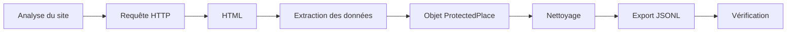
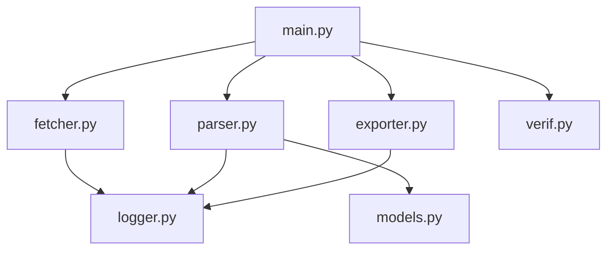
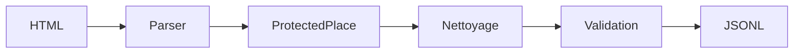
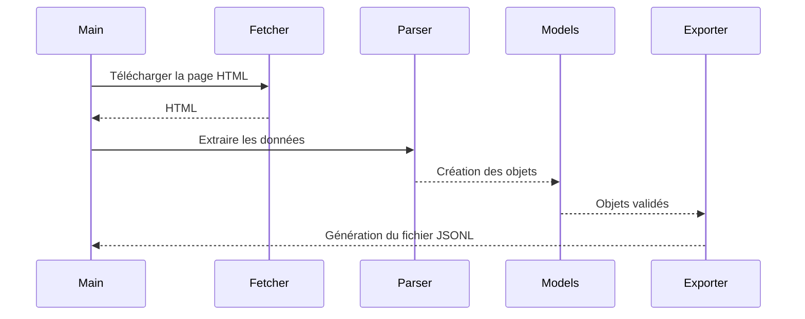

# TP Web Scraping S03 – Parcs Canada

**Étudiants :** Barakissa Koné & Anass Houdzi

**Formation :** Mastère IA, Développement & Data – IPSSI Lille

**Objet métier :** `ProtectedPlace`

**Site étudié :** https://parks.canada.ca/pn-np

---

# Présentation du projet

L'objectif de ce projet est de développer un scraper capable de récupérer automatiquement les informations des parcs nationaux publiés sur le site officiel de Parcs Canada.

Au-delà de l'extraction de données, nous avons cherché à construire un pipeline complet, depuis la récupération des pages HTML jusqu'à la génération d'un fichier JSONL propre et vérifié.

---

# Objectifs

Notre scraper permet de :

- télécharger les pages du site ;
- extraire les informations utiles ;
- transformer ces informations en objets Python ;
- nettoyer et valider les données collectées ;
- exporter les résultats au format JSON Lines (JSONL) ;
- vérifier automatiquement la qualité des données produites.

---

# Analyse de la cible

Avant de commencer le développement, nous avons analysé le fonctionnement du site.

Nous avons constaté que toutes les informations nécessaires étaient directement présentes dans le HTML retourné par le serveur. Le contenu n'étant pas généré dynamiquement par JavaScript, l'utilisation de Selenium n'était pas nécessaire.

Nous avons donc choisi une solution plus légère reposant uniquement sur `requests` et `BeautifulSoup`.

| Outil | Utilisation |
|--------|-------------|
| Requests | Téléchargement des pages HTML |
| BeautifulSoup | Analyse et extraction des données |
| Dataclass | Représentation des objets métier |
| JSONL | Export des données |

---

# Vue d'ensemble du pipeline



Le fonctionnement du scraper suit une chaîne simple : récupérer les pages, extraire les informations utiles, les nettoyer puis produire un export prêt à être exploité.

---

# Architecture du projet



Chaque module possède une responsabilité bien définie afin de faciliter la maintenance et l'évolution du projet.

---

# Structure du projet

```text
tp-scraping-s03-parcs-canada
│
├── config.py
├── main.py
├── verif.py
│
├── src
│   ├── fetcher.py
│   ├── parser.py
│   ├── models.py
│   ├── exporter.py
│   └── logger.py
│
├── docs
│
├── samples
│
└── data
```

---

# Description des fichiers

| Fichier | Description |
|----------|-------------|
| `config.py` | Paramètres de configuration du projet |
| `main.py` | Orchestration complète du pipeline |
| `fetcher.py` | Téléchargement des pages HTML |
| `parser.py` | Extraction des informations |
| `models.py` | Représentation et validation des objets |
| `exporter.py` | Export au format JSONL |
| `logger.py` | Gestion des journaux d'exécution |
| `verif.py` | Vérification automatique des résultats |

---

# Cycle de traitement des données



---

# Informations extraites

Chaque parc est représenté par un objet `ProtectedPlace`.

| Champ | Description |
|--------|-------------|
| `id` | Identifiant unique |
| `name` | Nom du parc |
| `province` | Province |
| `type` | Type de lieu protégé |
| `summary` | Description |
| `url` | URL absolue |
| `image_url` | URL de l'image |
| `collected_at` | Date de collecte |
| `source_url` | URL de la page d'origine |

---

# Fonctionnement du scraper



---

# Vérification des données

Le script `verif.py` permet de contrôler automatiquement les résultats sans effectuer de nouvelles requêtes HTTP.

Les vérifications réalisées sont les suivantes :

- contrôle du nombre d'objets extraits ;
- validation des URL absolues ;
- normalisation des provinces ;
- suppression des doublons ;
- rejet des objets incomplets.

### Résultat attendu

| Contrôle | Valeur |
|-----------|--------|
| Objets vus | 49 |
| Exportés | 47 |
| Rejetés | 2 |
| Doublons | 1 |
| Champs manquants | 2 |

---

# Installation

```bash
python -m venv .venv
```

Activation sous Windows :

```bash
.venv\Scripts\Activate.ps1
```

Installation des dépendances :

```bash
pip install -r requirements.txt
```

---

# Exécution

```bash
python main.py
```

Le scraper génère :

```text
data/parcs_canada.jsonl
```

---

# Vérification

```bash
python verif.py
```

---

# Ce que nous avons retenu

Ce projet nous a permis de mettre en pratique l'ensemble des étapes d'un pipeline de Web Scraping.

Nous avons notamment appris à :

- analyser une cible avant de développer ;
- choisir les outils adaptés au contexte ;
- structurer un projet en modules indépendants ;
- nettoyer et valider les données collectées ;
- produire un export directement exploitable.

---

# Limites

Le fonctionnement du scraper repose sur la structure actuelle du site de Parcs Canada.

Si l'organisation des pages ou les balises HTML évoluent, certains sélecteurs devront être adaptés.

---

# Répartition du travail

Le projet a été réalisé en binôme.

| Barakissa Koné | Anass Houdzi |
|----------------|--------------|
| Analyse de la cible | Développement du module Fetcher |
| Développement du Parser | Développement de l'Export JSONL |
| Modèle `ProtectedPlace` | Logger |
| Documentation | Vérification |
| Tests | Intégration finale |

Les différentes parties ont ensuite été relues, testées et validées ensemble avant la remise.

---

# Commandes utiles avant la remise

```bash
python -m compileall .
python verif.py
git status
git log -1 --oneline
```